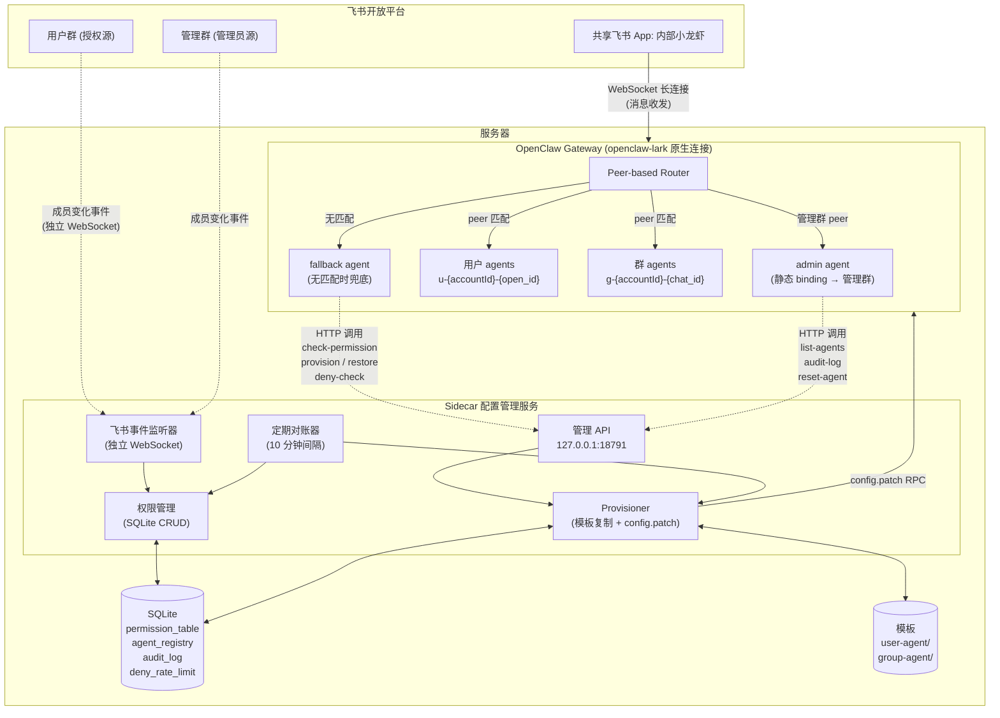
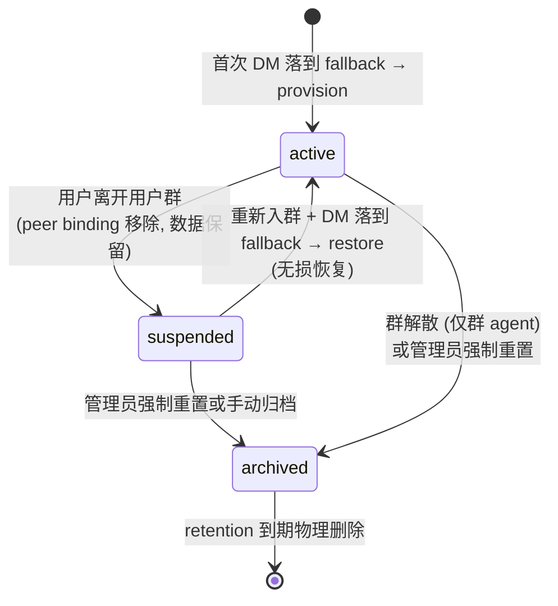

# 内部小龙虾 PRD —— 飞书 × OpenClaw 多租户 Agent 桥接系统

> Status: Draft v0.4 · Owner: Allen · Last Updated: 2026-04-13  
> Project codename: 内部小龙虾 (Internal Lobster)  
>
> **Changelog**:
> - v0.1 → v0.2: 管理群模式；多飞书 app 支持；移除产品叙事绑定
> - v0.2 → v0.3: 权限模型统一为"用户群驱动"；内部/外部人员一视同仁；增加 suspended 状态；管理员自动拥有 DM 权限；未授权频控；强制重置命令
> - v0.3 → v0.4: 架构调整为"Sidecar 配置管理者"模式 —— 复用 openclaw-lark 原生飞书连接 + peer-based routing，Sidecar 不拦截消息流，只通过 config.patch 管理 agent 生命周期；未授权拒绝由 fallback agent + Sidecar API 实现；从多飞书 App 模式迁移为单飞书 App + peer routing 模式；保持 WebSocket 连接方式

---

## 1. Executive Summary

「内部小龙虾」是一个把飞书 App 桥接到 OpenClaw Gateway 的多租户 agent 路由系统。**权限模型极简：一个预先配置的"用户群"是唯一的授权真相 —— 进群即有权限使用 bot，退群即失去权限，不区分内部员工和外部人员**。用户首次 DM bot 时系统自动为其创建隔离的专属 agent (含独立 workspace、SOUL.md、长期记忆)；bot 被拉进任意群时自动为该群创建群专属 agent。用户离开用户群时对应的 DM agent 进入 suspended 状态 (数据保留、路由摘除)，重新入群时无损恢复。群解散时对应的群 agent 被归档。管理员权限通过"管理群"授予，进管理群即有管理权，退出即收回。

核心技术架构是 **Sidecar 配置管理服务 + OpenClaw 原生 peer-based routing**。OpenClaw Gateway 通过 openclaw-lark 插件直接连接飞书（WebSocket 模式），使用 peer binding 将不同用户的 DM 路由到各自的专属 agent。Sidecar 服务独立运行，监听飞书群成员变化事件，通过 `config.patch` RPC 动态增删 agent 和 peer binding，实现"按需懒创建 + 群驱动权限"的多租户场景，无需修改 OpenClaw 本身。

---

## 2. Problem Statement

### Who has this problem?

**Primary**: 希望在企业内部或跨组织场景 (内部员工 + 外部合作伙伴 + 客户) 提供"每人专属 AI 助手"体验的技术团队，他们已经选择 OpenClaw 作为底层 agent runtime，但遇到了多租户场景的配置瓶颈。

**Secondary**: 这些团队的运维者 / 管理员，他们需要一个低运维成本、随成员关系自动调整的授权系统。

### What is the problem?

OpenClaw 是一个非常成熟的 personal AI assistant 框架，原生支持多 channel、多 agent 路由、per-agent workspace 和 session 隔离。但它有几个根本的架构假设让多租户场景难以落地：

1. **Agents 和 bindings 是声明式静态配置**，需要在 `openclaw.json` 里预先写死。50+ 人的场景不可扩展。
2. **配置变更需要手动介入**，频繁人员变动会产生持续的运维负担。
3. **权限模型绑定在 channel 配置层** (`dmPolicy: "allowlist"` + `allowFrom`)，复杂权限逻辑难以表达，且每次变更都要改配置文件。
4. **无法响应组织的动态变化** (群成员变动、群解散)，需要人工介入。
5. **共享 bot 会导致语境串话**，要做到真正隔离就要"一人一 agent"，但这在原生 OpenClaw 里是配置地狱。

### Why is it painful?

- **对用户**：要么忍受语境串话，要么没有 AI 助手可用
- **对管理员**：每加一个用户 / 每踢一个用户都要手动改配置 + restart，不可扩展；难以支持"按群成员授权"这种自然的权限表达
- **对系统**：无法响应组织的动态变化，需要人工介入，容易漏操作

### Evidence

- OpenClaw 官方文档明确指出 "direct chats collapse to the agent's main session key, so **true isolation requires one agent per person**" —— OpenClaw 设计语义假设"一人一 agent"，但没提供创建机制
- OpenClaw `config.patch` RPC 和 config hot reload 已 GA (v2026.3.12+)，技术前置条件齐备
- OpenClaw peer-based routing 原生支持：`match: { channel: "feishu", peer: { kind: "direct", id: "ou_xxx" } }` 可将特定用户 DM 路由到指定 agent
- openclaw-lark 插件使用 User Access Token (UAT) 做文档访问，天然按用户隔离，peer routing 模式下不会跨用户泄露
- 飞书 OpenAPI 完整支持本方案需要的所有事件订阅和群成员管理

---

## 3. Target Users & Personas

### Primary Persona: 用户 Alice

- **角色**：一个被管理员拉进"用户群"的人 (可能是内部员工，也可能是外部合作伙伴或客户)
- **技术水平**：能熟练使用飞书，不懂也不需要懂 OpenClaw 是什么
- **目标**：在飞书里得到一个能记住自己、了解自己背景的 AI 助手
- **使用频率**：每天多次 DM 对话 + 偶尔在群里 @

### Primary Persona: 系统管理员 Bob

- **角色**：被拉进"管理群"的运维人员，可以是一个或多个人
- **技术水平**：熟悉 OpenClaw、Linux、Python，能直接改配置文件和读日志
- **目标**：用最少的运维动作维持几十到几百个 agent 的健康运行；把人拉进用户群 / 管理群即等于完成授权，不需要改配置文件

### Secondary Persona: 群参与者 Charlie

- **角色**：任意飞书群里的成员 (必须本身已经在用户群里才有权触发 bot)
- **场景**：在项目群、讨论群里 @ 内部小龙虾作为群助手
- **期待**：群 agent 能记住整个群的历史讨论，语气比 DM bot 更克制

### Jobs-to-be-done

- **Alice**：「当我有工作问题时，我想 DM 一个了解我背景的 AI 助手，得到上下文相关的回答」
- **Bob**：「当有人需要使用 bot 时，我希望把他拉进用户群就完成授权；当有人不再需要时，把他踢出群就收回权限」
- **Charlie**：「当群里讨论需要 AI 协助时，我想 @ 一个了解整个群历史的群专属 bot」

---

## 4. Strategic Context

### Why now?

1. **OpenClaw 技术前置条件齐备**：v2026.3.12+ 支持 WebSocket 模式 + config hot reload + `config.patch` RPC + peer-based multi-agent routing
2. **飞书事件订阅成熟**：群成员、群解散、bot 入群等关键事件均已 GA
3. **OpenClaw 原生不会演化出这个能力**：OpenClaw 是 personal AI assistant 定位，不会往"多租户 + 动态权限"方向演化
4. **现有部署已验证核心假设**：当前实例已有 14 个 agent 通过独立飞书 App 运行，证明了"一人一 agent"模式可行，但手动配置不可扩展

### Value Proposition

| 方案 | 隔离度 | 自动化运维 | 开箱即用 | 权限灵活度 |
|---|---|---|---|---|
| 飞书自带 AI 助手 | ❌ 共享 | ✅ 高 | ✅ 高 | ❌ 不可定制 |
| 共享 bot (单 OpenClaw agent) | ❌ 共享 | ✅ 高 | ✅ 高 | ⚠️ 中 |
| 每人手动部署 OpenClaw | ✅ 强 | ❌ 低 | ❌ 低 | ✅ 高 |
| 每人一个飞书 App (当前状态) | ✅ 强 | ⚠️ 中 | ❌ 低 | ⚠️ 中 |
| **本方案：内部小龙虾** | ✅ 强 | ✅ 高 | ✅ 高 | ✅ 高 |

---

## 5. Solution Overview

### 核心概念

| 概念 | 定义 |
|---|---|
| **用户群 (User Group)** | 一个预先配置的飞书群，`chat_id` 写死在配置里。群成员 = 有权使用 bot 的人 |
| **管理群 (Admin Group)** | 一个预先配置的飞书群，群成员 = 拥有 admin 权限的人 |
| **Peer Binding** | OpenClaw 路由规则：`channel:feishu + peer:{open_id}` → 指定 agent。最高优先级匹配 |
| **权限表 (Permission Table)** | Sidecar SQLite 表，记录每个 `open_id` 当前是否在用户群 / 管理群里 |
| **Agent 注册表** | Sidecar SQLite 表，记录每个 agent 的 `agent_id`, `status`, workspace 路径, 创建时间 |
| **懒创建 (Lazy Provisioning)** | 用户首次对话时才 provision agent（首条消息落到 fallback，provision 完成后下一条消息路由到新 agent） |
| **Suspended 状态** | 用户离开用户群后：peer binding 从配置移除，但 workspace 和 session 数据物理保留 |
| **无损恢复 (Lossless Restore)** | 用户重新入群后下一次 DM 时只恢复 peer binding，不触碰 workspace 内容，历史记忆完整保留 |
| **Fallback Agent** | 静态配置的兜底 agent，接收所有无 peer binding 匹配的消息，调 Sidecar API 决定 provision/restore/拒绝 |

### High-level Architecture



### 核心组件职责

**飞书企业自建应用 (共享 App)**：
- 使用 WebSocket 模式连接（通过 openclaw-lark 插件），无需公网 HTTPS 入口
- 订阅消息事件 + 群成员变化事件 + 群解散事件 + bot 入群事件
- 在 OpenClaw 侧对应一个 `accountId`
- 使用 User Access Token (UAT) 做文档访问，天然按用户隔离

**OpenClaw Gateway (不修改)**：
- openclaw-lark 插件在 WebSocket 模式下连接飞书
- 使用 peer-based routing 将 DM 路由到对应 agent：`match: { channel: "feishu", peer: { kind: "direct", id: "ou_xxx" } }`
- `dmPolicy: "open"`：所有消息都进入 OpenClaw，由 fallback agent 处理未授权用户
- 静态配置的 admin agent 绑定到管理群
- Fallback agent 兜底所有无 peer binding 匹配的消息
- 用户 agent 和群 agent 由 Sidecar 通过 `config.patch` RPC 动态注入
- Hot reload (hybrid 模式)：agent/binding 变更即时生效

**Sidecar 配置管理服务 (新建)**：
- 独立进程，通过 launchd 管理
- **不拦截消息流**，只管理配置和权限
- **飞书事件监听**：独立 WebSocket 连接，订阅用户群/管理群的成员变化事件，实时更新 SQLite 权限表
- **Agent 生命周期**：通过 `config.patch` RPC 动态增删 agent 定义和 peer binding
- **管理 API**：HTTP server (127.0.0.1:18791)，供 fallback agent 和 admin agent 调用
- **定期对账**：每 10 分钟全量拉取群成员与权限表做 diff，修正事件丢失导致的不一致

**Fallback Agent (静态配置)**：
- 接收所有无 peer binding 匹配的消息
- **不调用 LLM**，纯确定性逻辑
- 调 Sidecar API 检查权限：
  - 已授权 + 无 agent → 触发 provision，回复"正在为您准备专属助手，请稍后再试"
  - 已授权 + agent suspended → 触发 restore，回复"正在恢复您的助手，请稍后再试"
  - 未授权 → 调 deny-check API 判断是否在频控窗口内，决定回复"您没有权限"或静默

### 统一权限模型

**单一真相**：是否在"用户群"里 = 是否有权使用 bot (不区分内部员工 / 外部人员)

| 用户状态 | DM 行为 | 群 @ 行为 |
|---|---|---|
| 在用户群里 (首次) | 消息落到 fallback → 触发 provision → 下次 DM 正常路由 | 正常响应 (群 agent 处理) |
| 在用户群里 (已有 agent) | 正常响应 (peer binding 路由) | 正常响应 (群 agent 处理) |
| 不在用户群里 | fallback 回复"没有权限" (10 分钟频控) | fallback 回复"没有权限" (同上) |
| 曾经在群里现在被踢了 | fallback 回复"没有权限"，DM agent 已 suspended | 同 DM |
| 被踢后重新入群 | 首条 DM 落到 fallback → 触发 restore → 下次 DM 正常路由 | 同 DM |

**管理员规则**：
- 管理群成员 = 管理员
- **管理员总是自动拥有 DM 使用权**，不需要额外在用户群里
- 管理员的 admin 能力通过"在管理群 @ bot"触发
- 管理员 DM bot 时：正常进入自己的 DM agent (跟普通用户一样)

### Key User Flows

**Flow A: 新用户入群 → 首次 DM 对话**

1. 管理员把 Alice 拉进用户群
2. 飞书推送群成员加入事件给 Sidecar (独立 WebSocket 监听)
3. Sidecar 更新权限表：`ou_alice` 为 authorized (不 provision，保持懒创建)
4. audit_log: permission_granted
5. Alice 首次 DM bot："你好"
6. OpenClaw 收到消息，无 `ou_alice` 的 peer binding → 路由到 fallback agent
7. Fallback agent 调 Sidecar API: `GET /api/v1/check-permission?open_id=ou_alice`
8. Sidecar 返回: `{ authorized: true, agent_exists: false }`
9. Fallback agent 调 Sidecar API: `POST /api/v1/provision?open_id=ou_alice`
10. Sidecar provisioner:
    a. 复制 `templates/user-agent/` → `~/.openclaw/agents/u-{accountId}-ou_alice/`
    b. 渲染 USER.md（填入 display_name 等）
    c. `config.patch`: 添加 agent 定义 + peer binding `{ kind: "direct", id: "ou_alice" }`
    d. 轮询 `config.get` 确认 hot reload 生效
    e. 注册表 INSERT: status=active
    f. audit_log: provision
11. Fallback agent 回复 Alice："正在为您准备专属助手，请再发一条消息开始对话"
12. Alice 发第二条消息 → peer binding 匹配 → 路由到 `u-{accountId}-ou_alice` → 首次见面欢迎

**Flow B: 已注册用户的后续对话**

1. Alice 后续发消息
2. OpenClaw peer routing: `ou_alice` 匹配 → 路由到 `u-{accountId}-ou_alice`
3. Agent 处理 → 回复
4. 耗时与原生 OpenClaw 一致，Sidecar 不参与

**Flow C: 用户离开用户群 → DM agent 进 suspended**

1. 管理员把 Alice 从用户群踢出
2. 飞书推送群成员移除事件给 Sidecar
3. Sidecar 更新权限表：`ou_alice` 为 unauthorized
4. Sidecar 调 `config.patch` 移除 `u-{accountId}-ou_alice` 的 peer binding (保留 agent 定义以便快速恢复，或一并移除)
5. Sidecar 更新注册表：状态为 `suspended`
6. **Sidecar 不移动 workspace 目录，数据物理保留在原位**
7. audit_log: suspend

**Flow D: 被踢用户重新入群 → 无损恢复**

1. 管理员把 Alice 重新拉回用户群
2. 飞书推送群成员加入事件给 Sidecar
3. Sidecar 更新权限表：`ou_alice` 恢复为 authorized
4. Sidecar **不**立即恢复 binding (保持懒触发语义)
5. Alice 发消息 → 无 peer binding → 落到 fallback
6. Fallback 调 Sidecar API: check-permission → `{ authorized: true, agent_exists: true, status: "suspended" }`
7. Fallback 调 Sidecar API: `POST /api/v1/restore?open_id=ou_alice`
8. Sidecar 进入 **restore** 路径：只调 `config.patch` 恢复 peer binding，不复制模板、不渲染 USER.md
9. 注册表 UPDATE: status=active, restored_at=now
10. audit_log: restore
11. Fallback 回复 Alice："您的助手已恢复，请再发一条消息继续对话"
12. Alice 下一条消息 → peer binding 匹配 → agent 加载原 workspace 和 session → **完整记忆恢复**

**Flow E: 未授权用户 → 拒绝 + 频控**

1. 未在用户群的 Dan 发消息
2. OpenClaw 无 `ou_dan` 的 peer binding → 路由到 fallback
3. Fallback 调 Sidecar API: `GET /api/v1/deny-check?open_id=ou_dan`
4. Sidecar 检查 deny_rate_limit 表：
   - 10 分钟内未拒绝过 → 返回 `{ should_reply: true, message: "您没有权限使用本助手，如需使用请联系管理员" }` + 记录时间戳
   - 10 分钟内已拒绝过 → 返回 `{ should_reply: false }`
5. Fallback 根据返回决定是否回复
6. 注意：消息经过了 fallback agent 但 **不调用 LLM**，资源消耗可忽略

**Flow F: 管理员在管理群触发管理操作**

1. Bob 在管理群发送 "@内部小龙虾 列出所有 active 的 agent"
2. OpenClaw 路由到 admin agent (静态 peer binding 匹配管理群 chat_id)
3. admin agent 识别意图 → 调用 Sidecar 管理 API `GET /api/v1/agents?status=active`
4. 返回结构化数据 → admin agent 格式化回复到群里

**Flow G: 管理员强制重置某用户 agent**

1. Bob 在管理群："@内部小龙虾 重置 @Alice 的 agent"
2. admin agent 识别意图 → 二次确认："确认要重置 Alice 的 agent 吗？这将清空她所有历史对话和记忆"
3. Bob 回复"确认"
4. admin agent 调用 `POST /api/v1/admin/reset-agent?open_id=ou_alice`
5. Sidecar 执行：
   - 调 `config.patch` 移除现有 agent 定义 + peer binding
   - mv workspace 目录到 `~/.openclaw/archived/u-{accountId}-ou_alice-reset-{timestamp}/`
   - 注册表删除该条目
   - audit_log: forced_reset
6. Alice 下次 DM bot 时触发全新 provision (走 Flow A)

**Flow H: bot 入群 → 群 agent 预创建**

1. 某用户把内部小龙虾拉进 "产品讨论组"
2. 飞书推送 bot 入群事件给 Sidecar
3. Sidecar 立即 provision 群 agent (`g-{accountId}-oc_xxx`)：
   a. 复制群 agent 模板
   b. `config.patch` 添加 agent + peer binding `{ kind: "group", id: "oc_xxx" }`
4. 群里首次 @ bot 时零延迟可用

注意：群里每个成员被 bot 响应的前提仍然是"该成员本身在用户群里"。群消息的 sender 权限检查通过 fallback 兜底——未授权 sender 的 @ 消息如果群 agent 已存在会正常路由到群 agent，需要在群 agent 的 SOUL.md 中配置权限检查逻辑，或接受群 agent 对所有群成员响应。

**Flow I: 群解散 → 群 agent 归档**

1. 群主解散某群
2. 飞书推送群解散事件给 Sidecar
3. Sidecar 调 `config.patch` 移除群 agent + peer binding
4. mv workspace 目录到 `~/.openclaw/archived/`
5. 注册表状态更新为 `archived`
6. audit_log: archive

### Agent 状态机



**关键规则**：
- **DM agent** 没有自动进入 archived 的路径，只会因管理员命令而归档
- **群 agent** 在群解散时自动进入 archived
- **强制重置**绕过 suspended，直接 archived，下次对话时全新 provision
- archived 的 workspace 被物理移动到 `~/.openclaw/archived/`

### 数据隔离与命名

**Agent 目录结构**：
```
~/.openclaw/agents/
├── admin/                          # 静态 admin agent
├── fallback/                       # 静态 fallback agent
├── u-cli_xxx-ou_alice/             # Alice 的 DM agent
├── u-cli_xxx-ou_bob/               # Bob 的 DM agent
├── g-cli_xxx-oc_product_group/     # 产品讨论群的群 agent
├── linyilun/                       # 迁移前的旧 agent (保留)
└── ...
~/.openclaw/archived/
├── u-cli_xxx-ou_bob-reset-2026-03-15T10:00:00/
├── g-cli_xxx-oc_old_group-2026-04-01T15:30:00/
└── ...
```

**兜底隔离**：`session.dmScope: "per-account-channel-peer"`，即使路由出错也不会串话

**文档权限隔离**：openclaw-lark 使用 User Access Token (UAT)，按 `{appId}:{userOpenId}` 存储，每个用户只能访问自己授权范围内的文档

---

## 6. Success Metrics

### Primary Metrics

| 指标 | 目标值 | 测量方式 |
|---|---|---|
| **首次对话体验** | 首条消息收到 fallback 提示 + 第二条消息正常响应 | fallback 回复 + peer routing 生效 |
| **后续对话延迟** (P95) | < 1.5 秒 | 与原生 OpenClaw 持平 (Sidecar 不参与消息流) |
| **Provision 成功率** | > 99% | SQLite agent_registry 状态统计 |
| **权限检查准确率** | 100% | 未授权必拒，已授权必通过 (零容忍) |
| **跨用户串话事件** | 0 | 自动化压测验证 (P0) |
| **Suspended → active 无损恢复成功率** | 100% | 验证重新入群后记忆完整 |
| **Sidecar 崩溃对已有用户影响** | 零 | 已有 peer binding 在 openclaw.json 中，不依赖 Sidecar 运行 |

### Secondary Metrics

| 指标 | 目标 | 说明 |
|---|---|---|
| **未授权拒绝响应延迟** | < 2 秒 | 经过 fallback agent + Sidecar API |
| **频控命中率** | > 90% | 未授权用户重复发消息时只收到一次拒绝 |
| **管理员每周手动干预次数** | < 1 | 系统应自给自足 |
| **Agent 状态机非法转换** | 0 | 不应出现 archived → active 之类的转换 |
| **config.patch 成功率** | > 99% | 含限速队列合并后的成功率 |

### Anti-metrics

- **不要**优化"创建了多少 agent"——数量不是目标
- **不要**追求"admin agent 更聪明"——admin 核心是稳定可靠

---

## 7. User Stories & Requirements

### Epic Hypothesis

> **We believe** 通过让 Sidecar 监听飞书群成员变化并通过 `config.patch` 动态管理 OpenClaw 的 peer binding 和 agent 生命周期，配合 fallback agent 处理未匹配消息，  
> **for** 技术团队和他们的最终用户，  
> **will** 实现"每人专属隔离 AI 助手 + 群成员驱动的简单权限模型"的体验，同时管理员零手动维护。  
> **We will know this is true when** 4 周内有 ≥10 个真实用户使用、后续对话延迟与原生 OpenClaw 持平、零串话事件、零权限检查失误、管理员每周干预 < 1 次。

完整 user stories 见独立文档 `user-stories-feishu-openclaw.md`，按三个视角组织。

### Constraints

**Technical**:
- `config.patch` RPC 限速 3 次/60s (per deviceId+clientIp)，需要 Sidecar 内部 5 秒窗口合并队列
- `config.patch` 中 `bindings` 是数组，JSON merge patch 语义下数组整体替换，每次 patch 前必须 `config.get` 获取当前完整 bindings
- 飞书事件推送 at-least-once，必须 event_id 幂等去重
- OpenClaw 单进程性能上限需 PoC 验证
- 首次 DM 需要两条消息才能到达新 agent (fallback → provision → 用户重发)

**Operational**:
- Sidecar 通过 launchd 管理，独立于 OpenClaw Gateway 进程
- 用户群和管理群的 chat_id 部署时写入 Sidecar 配置
- Agent 模板从 git 仓库版本化管理
- 现有 14 个 agent 需无缝迁移（从 accountId routing 到 peer routing）

**Compliance**:
- agent workspace 可能含敏感信息，需磁盘加密或访问控制
- suspended / archived 目录的 retention 策略可配置 (默认 90 天)

---

## 8. Out of Scope

**本期不做**：

- **员工离职自动响应**：不订阅 `contact.user.deleted_v3`。员工离职后管理员需要手动从用户群踢出
- **按消息内容的细粒度权限**：只有"能用 / 不能用"两种状态
- **管理员 Web Dashboard**：本期管理员通过管理群 @ admin agent 对话来管理
- **付费 / 配额管理**：内部使用不做
- **Agent marketplace**：模板手动维护在 git
- **Multi-region / HA**：单机部署足够 MVP
- **OpenClaw 横向扩展**：等用户量超上限再做
- **群 agent 的细粒度成员权限**：群 agent 对所有群成员响应（或在 SOUL.md 层面做软限制）
- **用户自改 SOUL.md** (防 prompt injection)
- **内部/外部身份区分**：权限模型对两者完全一致
- **消息拦截/转发模式**：Sidecar 不参与消息流，只管理配置
- **首次 DM 单条消息触达**：接受 fallback → provision → 用户重发的两步体验

**未来可能做**：
- 飞书消息卡片管理 UI
- 按群分组的模板 (不同用户群对应不同 agent 人格)
- 自动 retention 清理
- 首次 DM 消息重放（研究 OpenClaw 是否支持将 fallback 收到的消息转发给新 agent）

---

## 9. Dependencies & Risks

### Technical Dependencies

| 依赖 | 状态 | 风险 |
|---|---|---|
| OpenClaw v2026.4.1 peer-based routing | ✅ 已验证 (当前实例) | 低 |
| `config.patch` RPC + hot reload (hybrid) | ✅ 文档确认 + 当前实例已启用 | 中：bindings 数组整体替换需小心 |
| openclaw-lark 插件 WebSocket 模式 | ✅ 当前实例已使用 | 低 |
| openclaw-lark UAT 文档隔离 | ✅ 代码分析已验证 | 低 |
| 飞书群成员变化事件订阅 | 待验证具体事件名称 | 中 |
| 共享飞书 App 创建与审批 | 待申请 | 中 |

### Risks & Mitigations

| 风险 | 影响 | 缓解措施 |
|---|---|---|
| **权限表与飞书成员状态不一致** (事件丢失) | 未授权用户能用 / 授权用户被拒 | 定期对账：每 10 分钟全量拉用户群和管理群成员做 diff 修正 |
| **`config.patch` RPC 限速 3/60s 被打满** | 批量入群时无法 provision | Sidecar 内部 5 秒窗口合并队列 |
| **bindings 数组并发修改冲突** | config.patch 失败 (baseHash 不匹配) | 获取新 baseHash 后重试；合并队列减少并发频率 |
| **Hot reload 不能立即生效** | provision 后消息仍落到 fallback | 轮询 `config.get` 确认 binding 生效；fallback 提示用户稍后重试 |
| **跨用户语境串话** (P0) | 隐私事故 | peer binding 精确路由 + per-account-channel-peer dmScope 兜底 + 上线前 N=10 用户并发压测 |
| **OpenClaw 单进程 50+ agent 性能** | 响应延迟变长 | PoC 压测确定上限 |
| **Sidecar 崩溃** | 新用户无法 provision，权限变更暂停 | launchd 自动重启；**已有用户不受影响** (peer binding 已持久化在 openclaw.json) |
| **Prompt injection 攻击 admin agent** | 误操作其他 agent | 破坏性操作必须二次确认；admin 权限通过管理群成员关系校验 |
| **现有 14 个 agent 迁移** | 服务中断 | 三步迁移：并行运行 → 逐用户切换 → 清理。每步可回滚 |
| **飞书事件名称不准确** | 事件监听失败 | 实现时对照飞书 API 文档验证，PRD 中标注为"待验证" |

---

## 10. Open Questions

### Week 1 PoC 必须验证

1. ~~OpenClaw feishu webhook server 的实际端口和 URL 路径~~ → 已确认：WebSocket 模式，无需 webhook
2. `config.patch` RPC 返回时 in-memory routing 是否已切换 (需轮询 `config.get` 验证)
3. peer binding `{ kind: "direct", id: "ou_xxx" }` 的实际路由行为验证
4. fallback agent 的配置方式：`default: true` 还是其他机制
5. bindings 数组 config.patch 的原子性：并发 patch 时的 baseHash 冲突处理
6. 飞书群成员变化事件的准确事件名称和 payload 格式

### 待决定

7. 模板升级策略 (建议仅影响新 agent)
8. Suspended / archived retention 期 (建议默认 90 天可配置)
9. 管理员被移除时正在执行的操作是否立即中止 (建议中止)
10. 未授权消息文案是否提供管理员联系方式
11. 群 agent 是否需要做 sender 权限检查 (建议 MVP 不做，群 agent 对所有群成员响应)

### 长期方向

12. 首次 DM 消息重放可行性研究
13. 未来支持其他企业 IM 的 Sidecar 抽象方式
14. Suspended 状态的管理 UI 展示方式

---

## Appendix A: Glossary

| 术语 | 解释 |
|---|---|
| **OpenClaw** | 开源 personal AI assistant 框架 |
| **Agent** | 完整隔离的 AI 实例，有独立 workspace, agentDir, sessions, SOUL.md |
| **Workspace** | Agent 工作目录，存放 SOUL.md / AGENTS.md / USER.md |
| **Peer Binding** | OpenClaw 路由规则：`channel + peer → agent`，最高优先级匹配 |
| **用户群** | 预配置的飞书群，成员关系 = 授权关系 |
| **管理群** | 预配置的飞书群，成员 = 管理员 |
| **权限表** | Sidecar SQLite 中记录当前授权用户的表 |
| **Agent 注册表** | Sidecar SQLite 中记录所有 agent 元数据的表 |
| **Sidecar** | 本项目自建的配置管理服务（不拦截消息流） |
| **Fallback Agent** | 静态配置的兜底 agent，处理无 peer binding 匹配的消息 |
| **Provision** | 为新用户 / 新群动态创建 agent + peer binding |
| **Suspend** | 移除 peer binding 但保留 workspace 数据 |
| **Restore** | suspended → active，只恢复 peer binding |
| **Archive** | workspace 物理移动到 archived/ 目录 |
| **Reset** | 管理员强制清除某用户的 agent |
| **Hot reload** | OpenClaw 不重启进程重新加载配置 |
| **`config.patch` RPC** | OpenClaw 增量配置更新接口 (JSON merge patch 语义) |
| **UAT** | User Access Token，openclaw-lark 按用户隔离的文档访问令牌 |

## Appendix B: Reference Links

- [OpenClaw Multi-Agent Routing](https://docs.openclaw.ai/concepts/multi-agent)
- [OpenClaw Session Management](https://docs.openclaw.ai/concepts/session)
- [OpenClaw Feishu Channel](https://docs.openclaw.ai/channels/feishu)
- [OpenClaw Gateway Configuration](https://docs.openclaw.ai/gateway/configuration)
- [飞书事件订阅](https://open.feishu.cn/document)

## Appendix C: Migration from Multi-App to Single-App

### Current State (14 apps, accountId routing)

```json5
// openclaw.json (simplified)
{
  "channels": {
    "feishu": {
      "accounts": {
        "linyilun": { "appId": "cli_aaa", "appSecret": "..." },
        "hr":       { "appId": "cli_bbb", "appSecret": "..." },
        // ... 12 more
      }
    }
  },
  "bindings": [
    { "agentId": "linyilun", "match": { "channel": "feishu", "accountId": "linyilun" } },
    { "agentId": "hr",       "match": { "channel": "feishu", "accountId": "hr" } },
    // ...
  ]
}
```

### Target State (1 shared app, peer routing)

```json5
{
  "channels": {
    "feishu": {
      "appId": "cli_shared",
      "appSecret": "...",
      "dmPolicy": "open"
    }
  },
  "bindings": [
    // Static
    { "agentId": "admin",    "match": { "channel": "feishu", "peer": { "kind": "group", "id": "oc_admin_xxx" } } },
    { "agentId": "fallback", "match": { "channel": "feishu" } },  // lowest priority, no peer = catch-all
    // Dynamic (managed by Sidecar via config.patch)
    { "agentId": "u-cli_shared-ou_alice", "match": { "channel": "feishu", "peer": { "kind": "direct", "id": "ou_alice" } } },
    { "agentId": "u-cli_shared-ou_bob",   "match": { "channel": "feishu", "peer": { "kind": "direct", "id": "ou_bob" } } },
    // ...
  ]
}
```

### Migration Steps

**Step 1: 并行运行（零风险）**
- 保留所有 14 个飞书 App 和 accountId binding
- 新增共享 App account 配置
- 启动 Sidecar，导入现有用户 open_id 到权限表
- 为现有用户添加 peer binding（与旧 accountId binding 并存）
- 验证：通过共享 App DM，消息是否正确路由

**Step 2: 逐用户切换**
- 每个用户确认共享 App 路由正常后：停用旧 App、移除旧 binding
- 可以一次切一个，有问题立即回退

**Step 3: 清理**
- 所有用户切换完成后，移除旧 App 的 account 配置
